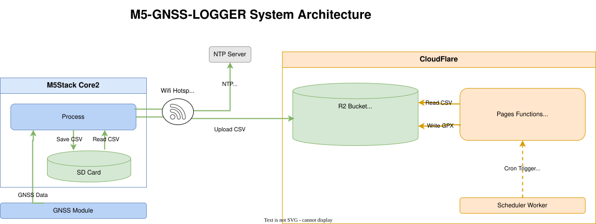

# M5-GNSS-LOGGER

M5Stack Core2でGNSSデータを記録し、Cloudflare R2を経由してGPX形式に変換するやつ

## 概要

M5-GNSS-LOGGERは、3つの主要コンポーネントからなるGNSS（GPS）ロギングシステムです：

1. **M5Stack Core2ファームウェア** ([m5GnssLogger/](m5GnssLogger/)) - GPSデータを1秒ごとに取得し、WiFi接続時にCloudflare R2に自動アップロード
2. **Cloudflare Pages Functions** ([cloud/pages-functions/gpx-converter/](cloud/pages-functions/gpx-converter/)) - R2上のCSVファイルをGPX 1.1形式に変換
3. **Cloudflare Scheduler Worker** ([cloud/workers/gpx-converter-scheduler/](cloud/workers/gpx-converter-scheduler/)) - 毎時自動実行またはHTTP手動トリガーでPages Functionsを呼び出し

### 特徴

- **高精度GNSSデータ記録** - u-blox NEO-M9N対応、HDOP・衛星数・位置変化によるデータフィルタリング
- **自動R2アップロード** - 指定したWiFiアクセスポイント検出時に自動接続し、CSVデータをアップロード
- **NTP時刻同期** - WiFi接続時にNTPサーバーと同期、失敗時はGPS時刻でフォールバック
- **スケーラブルなGPX変換** - Cloudflareインフラによる自動処理、4MB超ファイルの自動分割（Google My Maps対応）
- **タイムゾーン処理** - カスタムメタデータによるタイムゾーン情報の保存とGPXへの反映

## アーキテクチャ

### システム構成図



### 3つの主要コンポーネント

#### 1. M5Stack Core2ファームウェア (m5GnssLogger/)

GNSSデータの取得、SDカード保存、WiFi接続時のR2アップロードを担当します。

- **データ取得**: 1秒ごとのGNSSデータ取得（u-bloxライブラリ使用）
- **データ保存**: SDカードへのCSV保存（フィルタリング済みデータ + 生データ）
- **WiFi接続**: 指定SSID検出時に自動接続
- **R2アップロード**: AWS Signature V4による直接PUTアップロード
- **NTP同期**: WiFi接続時の時刻同期（失敗時はGPS時刻でフォールバック）

#### 2. Cloudflare Pages Functions (cloud/pages-functions/gpx-converter/)

R2上のCSVファイルをGPX 1.1形式に変換します。

- **GPX変換**: CSVからGPX 1.1形式への変換
- **ファイル分割**: 4MB超ファイルの自動分割（Google My Maps対応）
- **タイムゾーン処理**: CSVメタデータからタイムゾーン情報を読み取り、GPXのUTC時刻に変換
- **R2バインディング**: `BUCKET`バインディング経由でR2にアクセス

#### 3. Cloudflare Scheduler Worker (cloud/workers/gpx-converter-scheduler/)

Pages Functionsを定期的または手動でトリガーします。

- **Cronトリガー**: 毎時0分に自動実行（`"0 * * * *"`）
- **HTTPトリガー**: `POST /trigger`で手動実行可能
- **ヘルスチェック**: `GET /test`で動作確認

## クイックスタート

### 前提条件

- M5Stack Core2 + GNSS Unit (NEO-M9N)
- PlatformIO対応のIDE（VS Code + PlatformIO拡張など）
- Cloudflareアカウント（無料枠で動作可能）
- Node.js 18+ （Cloudflare Workersデプロイ用）

### 1. Cloudflare R2の設定

Cloudflare DashboardでR2バケットを作成します：

1. **R2バケット作成**
   - Dashboard → R2 → Create Bucket
   - バケット名: 任意の名前（例: `gnss-bucket`）

2. **R2 APIトークン作成**
   - R2 → Manage R2 API Tokens → Create API Token
   - パーミッション: Object Read & Write
   - 作成されたAccess KeyとSecret Keyを保存

### 2. Cloudflare設定ファイルの作成

```bash
# 設定テンプレートをコピー
cp cloud/.config/.dev.vars.example cloud/.config/.dev.vars
```

`.dev.vars`を編集して以下の値を設定：

```bash
# Cloudflare Account ID (Dashboardの右下に表示)
CLOUDFLARE_ACCOUNT_ID=your_account_id_here

# Cloudflare API Token (Workers ScriptsとR2の編集権限が必要)
# 作成場所: https://dash.cloudflare.com/profile/api-tokens
CLOUDFLARE_API_TOKEN=your_api_token_here

# R2 Bucket Name (手順1で作成したバケット名)
R2_BUCKET_NAME=your_bucket_name_here

# Pages Function URL (後ほどデプロイ後に確認)
PAGES_FUNCTION_URL=https://gpx-converter.<your-project>.pages.dev/gpx-converter
```

### 3. M5Stack設定ファイルの作成

```bash
# 設定テンプレートをコピー
cp m5GnssLogger/include/.env.example.h m5GnssLogger/include/.env.h
```

`.env.h`を編集して以下の値を設定：

```cpp
// 接続しにいくWiFiホットスポットの SSIDとパスワード
#define WIFI_SSID "your_wifi_ssid"
#define WIFI_PASSWORD "your_wifi_password"

// R2設定
#define R2_ACCOUNT_ID "your_account_id_here"
#define R2_BUCKET_NAME "your_bucket_name_here"
#define R2_ACCESS_KEY "your_access_key_here"
#define R2_SECRET_KEY "your_secret_key_here"
#define R2_REGION "auto"
```

### 4. Scheduler Workerのデプロイ

```bash
cd cloud/workers/gpx-converter-scheduler

# 依存関係をインストール
npm install

# デプロイ（スクリプトが環境変数を自動設定）
bash deploy.sh
```

デプロイが成功すると、Worker URLが表示されます。このURLを`.dev.vars`の`SCHEDULER_WORKER_URL`に設定してください。

### 5. Pages Functionsのデプロイ

```bash
cd cloud/pages-functions/gpx-converter

# デプロイ（スクリプトが環境変数を自動設定）
bash deploy.sh
```

デプロイが成功すると、Pages Functions URLが表示されます。このURLを`.dev.vars`の`PAGES_FUNCTION_URL`に設定し、Scheduler Workerを再デプロイしてください。

### 6. M5Stackファームウェアのビルド

```bash
cd m5GnssLogger

# 依存関係をインストール
pio pkg install

# ビルド
pio run --environment m5stack-core2

# M5Stackにアップロード
pio run --target upload --environment m5stack-core2
```

## M5Stackファームウェア

### ビルドとデプロイ

```bash
cd m5GnssLogger

# 依存関係をインストール
pio pkg install

# ビルド
pio run --environment m5stack-core2

# M5Stackにアップロード
pio run --target upload --environment m5stack-core2

# シリアル出力をモニター（デバッグ用）
pio device monitor
```

## Cloudflare Scheduler Worker

### 機能

Scheduler Workerは、Pages Functionsをトリガーするための軽量なWorkerです。

- **Cronトリガー**: 毎時0分に自動実行（`[triggers] cron = ["0 * * * *"]`）
- **HTTPトリガー**: `POST /trigger`で手動実行
- **ヘルスチェック**: `GET /test`で動作確認

### 環境変数

[wrangler.toml](cloud/workers/gpx-converter-scheduler/wrangler.toml)または`.dev.vars`で設定：

| 変数 | 必須 | 説明 |
|------|------|------|
| `PAGES_FUNCTION_URL` | ✓ | Pages FunctionsのURL（例: `https://gpx-converter.example.pages.dev/gpx-converter`） |

### デプロイ

```bash
cd cloud/workers/gpx-converter-scheduler

# 依存関係をインストール
npm install

# デプロイ（スクリプトが環境変数を自動設定）
bash deploy.sh
```

### エンドポイント

- `GET /test` - ヘルスチェック
- `POST /trigger` - 手動トリガー

## Cloudflare Pages Functions

### 機能

Pages Functionsは、R2上のCSVファイルをGPX形式に変換します。

- **CSV → GPX変換**: 標準的なGPX 1.1形式に変換
- **ファイル分割**: 4MB超のファイルを自動分割（Google My Mapsの5MB制限に対応）
- **タイムゾーン処理**: CSVのメタデータからタイムゾーンを読み取り、GPXのUTC時刻に変換
- **再実行安全**: 既にGPXが存在する場合はスキップ

### R2バインディング

[wrangler.toml](cloud/pages-functions/gpx-converter/wrangler.toml)でR2バケットをバインド：

```toml
[[r2_buckets]]
binding = "BUCKET"
bucket_name = "${R2_BUCKET_NAME}"
```


### デプロイ

```bash
cd cloud/pages-functions/gpx-converter

# デプロイ（スクリプトが環境変数を自動設定）
bash deploy.sh
```

## セキュリティ

機密ファイルをコミットしないでください。これらは`.gitignore`によってバージョン管理から除外されています：

- `m5GnssLogger/include/.env.h` - WiFi/R2設定ファイル
- `cloud/.config/.dev.vars` - Cloudflare Workers/Pages環境変数

代わりに以下のテンプレートファイルを使用してください：

- `m5GnssLogger/include/.env.example.h` - M5Stack設定テンプレート
- `cloud/.config/.dev.vars.example` - Cloudflare設定テンプレート

### 実際の設定方法

```bash
# M5Stack用
cp m5GnssLogger/include/.env.example.h m5GnssLogger/include/.env.h

# Cloudflare用
cp cloud/.config/.dev.vars.example cloud/.config/.dev.vars
```

`.env.h`と`.dev.vars`を編集して実際の値を入力してください。

### 機密情報の一覧

以下の情報は機密情報として扱われます：

- WiFi SSIDとパスワード
- Cloudflare Account ID
- R2 Access KeyとSecret Key
- Cloudflare API Token

これらの値を誤ってGitHubなどに公開しないよう、十分に注意してください。


## GPX変換トリガー方法

### 自動トリガー（Cron）

Scheduler Workerは毎時0分に自動的に実行されます。手動設定は不要です。

```bash
# Schedulerのステータスを確認
curl https://gpx-converter-scheduler.<account>.workers.dev/test
```

### 手動トリガー

プロジェクト提供のスクリプトを使用すると簡単です：

```bash
cd cloud/workers/gpx-converter-scheduler

# スクリプトを使用してトリガー（推奨）
bash tools/manual_trigger.sh

# ヘルスチェックのみ
bash tools/manual_trigger.sh --health

# 詳細出力
bash tools/manual_trigger.sh --verbose

# 使用方法を表示
bash tools/manual_trigger.sh --help
```

スクリプトは以下の場所からURLを自動的に読み込みます：

1. `tools/.worker-url`（デプロイ時に自動生成）
2. `.dev.vars`の`SCHEDULER_WORKER_URL`
3. 引数で直接指定

## 開発

### コードフォーマット（C++）

```bash
# リポジトリルートから - フォーマットチェック（読み取り専用、CI用）
docker build -t clang-format-check ./tools
docker run --rm -e DRY_RUN=true -v "$(pwd):/workspace" clang-format-check

# ファイルをフォーマット（その場で修正）
docker run --rm -v "$(pwd):/workspace" clang-format-check
```

フォーマットは、[`.clang-format`](.clang-format)を使用（Googleベースのスタイル、2スペースインデント、100文字行制限）。

### コードフォーマット（TypeScript）

```bash
# リポジトリルートから - フォーマットチェック（読み取り専用、CI用）
npm run format:check

# ファイルをフォーマット（その場で修正）
npm run format

# 各プロジェクトで個別にフォーマット
cd cloud/workers/gpx-converter-scheduler
npm run format

cd ../../pages-functions/gpx-converter
npm run format
```

フォーマットは、[`biome.json`](biome.json)を使用（Google TypeScript Style Guide準拠、2スペースインデント、100文字行制限）。

### デバッグ

#### M5Stackのシリアルモニタ

```bash
cd m5GnssLogger
pio device monitor
```

#### Workersのログ確認

```bash
cd cloud/workers/gpx-converter-scheduler
npx wrangler tail
```

```bash
cd cloud/pages-functions/gpx-converter
npx wrangler pages deployment tail --project-name=gpx-converter
```
